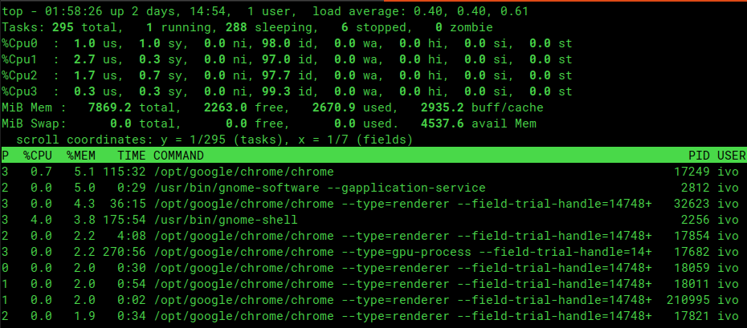
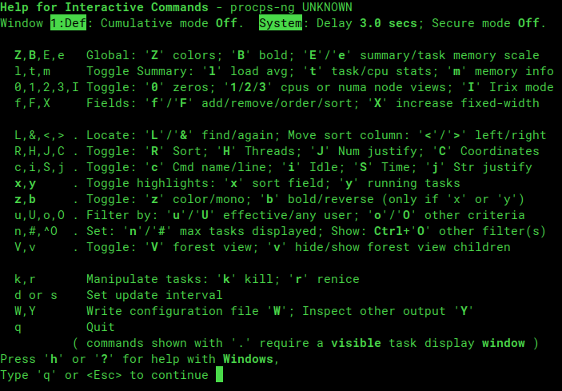
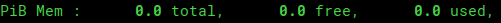
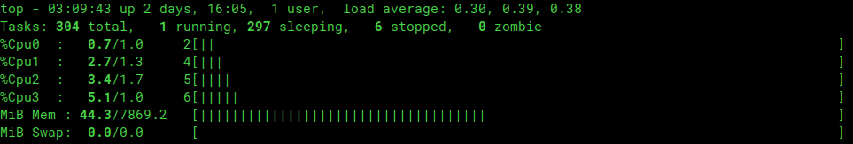
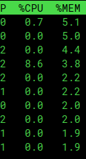
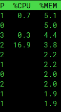
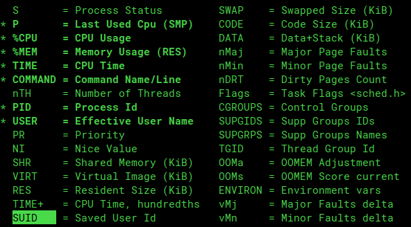
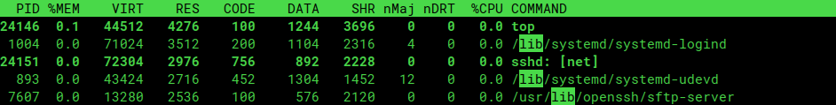
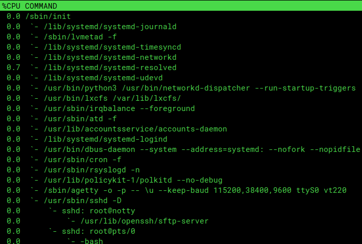
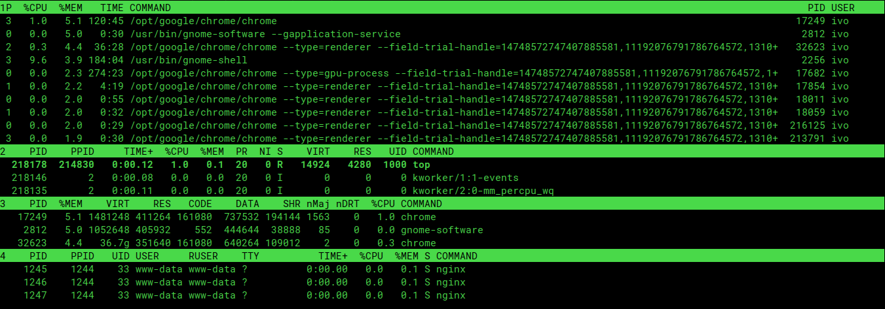

# Mastering top
This article is also available on my website: [Mastering top](https://elenchev.com/mastering-top-unix-administration/)
In the next 5 mintues I'll help you level up your top skills. If you don't have 5 min right now, just star it for future reference!

## Shortcuts & options for effective unix administration
I almost titled this post "Top top tips", but decided to go for the boring title instead.

You've probably used top before, but did you know you can have a custom config? Did you know you can split it into several sections, change the columns and their ordering, add bar charts, filter by process name, remove useless clutter and all that in just a few shortcuts? Well, you can.



## ? is often better than a man page
That's not a question. As with most of software development or system administration, the most importat thing you can learn is how and where to search for the information that you need. Open top and hit the `?` key, you'll be prompted with a succinct help screen describing a bunch of different shortcuts. It doesn't cover all the functionality of top, but you can quickly access it if you already have top open. Press `q` when you've found the command you were looking for and you'll be brought back to the default top screen. If you didn't find what you were looking for, check the manual with:
```
man top
```


The first useful bit of information is that you can press `SHIFT + E` to cycle through the available memory units. Here you can see that my laptop has approximately 0 petabytes of RAM. Ok, I promise the following tips will be more useful than this one.


## Making things easier to understand
If you're more of a visual person, you'll probably prefer the bar chart view for CPU & memory usage. Cycle through the display options with `t` for tasks (CPU) and `m` for memory and you'll end up with something like this:

One disadvantage of using the chart view is that it hides some useful data like average iowait, but you can quickly go back to the default view by pressing `t` again.

While we're on the topic of making information easier to digest, you can hide all the useless 0s in the process details list by pressing `0` One of these is better than the other:


The keys `1`, `2` and `3` will cycle through different levels of detail for the CPU core summary at the top of the screen, you might find that useful if you're working with unusually slow single-threaded applications.

## All the data you need in one place
What if the information you need isn't available in top? Well maybe it is, you just don't know it yet. Press `f` and you'll be presented with what you grandfather called a select dropdown. You can add new columns or remove existing ones with `space`, or change the default sort column with `s` You can also reorder columns, by pressing `🠮` to select a column, moving it to its new location with the arrow keys and pressing `🠬`

there are about 40 additional columns, not shown in this screenshot

## Saving your new top config
It would suck if you had to go through the tedious procedure of rearranging columns & changing display options every time you need top, right? Well you don't have to! Just press `SHIFT + W` and your config will be saved. Every user gets their own config, so you don't have to worry about affecting your coworkers, unless you're one of the people who like to live dangerously and you use the root account for everything. Please don't do that at home. Please don't do that at work either.


## Processes and how to find them
Usually you only care about the processes taking up most of the resources on your system. You can easily find them by sorting by the appropriate column. Sort by memory with `SHIFT + M` or by CPU usage with `SHIFT + P` If you find yourself changing the default sorting often, it'll probably be best to just change the defaults and save your config.

In case you're looking for a specific process press `SHIFT + L`, type its name and press enter. top will scroll to the first result and highlight all matching substrings.


Now that you've found your victim press `k` to kill the process.

You can change the process description as well. Switch between the process name and the command that it was launched with by pressing `c` This is very useful for looking at cli params. Another useful shortcut is `SHIFT + H` which lets you look at process threads. If you're trying to debug a process that spawns child processes switch to tree view with `SHIFT + V`



## Unlimited power
By now you're probably thinking, "ok this is all really cool, but what I really need is something that will bring my top game to the next level. Something that will force my boss to give me raise and get my significant other interested in Linux administration". Enter top alternative mode.

You've probably never dared to press `SHIFT + A` before. Few wield the power of the alternative mode, but today you can join this prestigious society. Alternative mode splits the process list into 4 separate lists. They show CPU, memory, recent process and user information respecively. They're each sorted by the field which matters most to that particular view, which makes alternative mode very useful when you want to see the top resources taking up server CPU & memory at the same time

What's even cooler than that is that you can customize each of these 4 lists. The process very similar to changing the column layout in normal mode, except that you have to press `g` and then enter the list index (1 to 4) for the list you want to modify.

Something that's not very useful in normal mode, but is amazing is alternative mode is that you can modify the max number of items shown in each list by pressing `n` and entering the desired list length (0 stands for unlimited). Super useful if you want to dedicate more rows to CPU & memory usage. Finally don't forget to save your layout with `SHIFT + W`


## The end
That's it ladies and gentlemen. You now know more about top than the average system administrator. You can use this power to do good, like quickly diagnosing system issues. You can also use it to do evil, by changing the top config of your cowerkers to show 1 process sorted by code size in kb and altering the system summary to hide all mentions of CPU & server load and show memory usage in picobytes instead.

I'll leave that choice to you.

### Credits
If you enjoyed this article, you might find my website interesting: [elenchev.com](https://elenchev.com)
